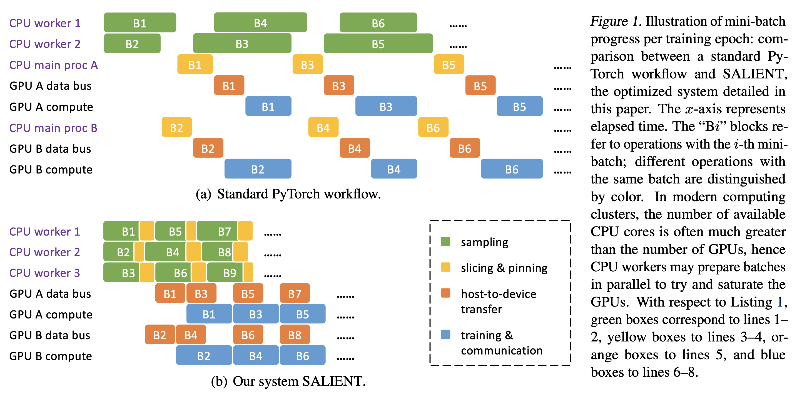

SALIENT
=======

SALIENT is a distributed multi-GPU training and inference system for graph neural networks (GNNs), targeting at massive graphs. It effectively mitigates (and with sufficient memory bandwidth, nearly eliminates) the bottleneck of a PyTorch workflow on mini-batch generation and transfer, rendering the overall training/inference time dominated by GPU computation. The system is described in the paper [Accelerating Training and Inference of Graph Neural Networks with Fast Sampling and Pipelining](https://arxiv.org/abs/2110.08450) published at MLSys 2022. This repository contains the codes of SALIENT.



## Setup and Example Usage

SALIENT can be run on a machine with one or multiple GPUs or on a GPU cluster.

* See this [README](docs/README_single_machine.md) for instructions to setup the system on a GPU machine.
* See this [README](docs/README_Satori.md) for instructions to setup the system on the Satori cluster.

Pointers of example usage of SALIENT are given in these instructions.

## Extension

SALIENT is designed to be fully compatible with PyG. In particular, defining a GNN architecture is done the same way as writing a usual PyG code.

* See this [README](docs/README_architecture.md) for instructions to add a GNN architecture.
* See this [README](docs/README_dataset.md) for instructions to add a dataset.

## Artifacts

While this repository is being maintained, a frozen version that reproduces the key results in the paper can be found in a separate [artifact repository](https://github.com/MITIBMxGraph/SALIENT_artifact).

## Reference

Please cite this paper if you use the codes in your work:

```
@INPROCEEDINGS{Kaler2022,
  AUTHOR = {Tim Kaler and Nickolas Stathas and Anne Ouyang and Alexandros-Stavros Iliopoulos and Tao B. Schardl and Charles E. Leiserson and Jie Chen},
  TITLE = {Accelerating Training and Inference of Graph Neural Networks with Fast Sampling and Pipelining},
  BOOKTITLE = {Proceedings of Machine Learning and Systems 4},
  YEAR = {2022},
}
```

## Contributors

SALIENT is developed by the xGraph team at the MIT-IBM Watson AI Lab.